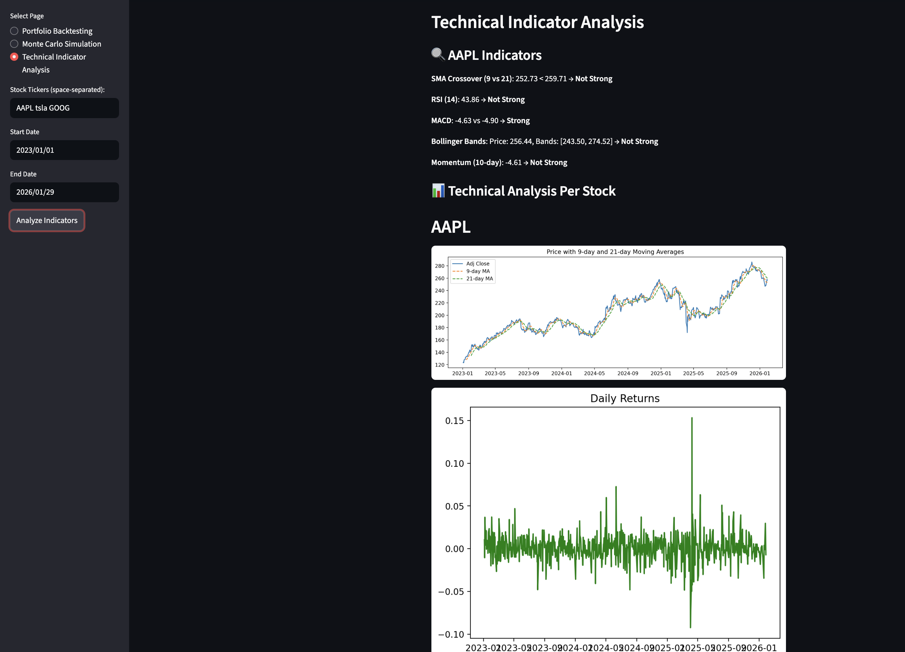

# Stock Portfolio Management Tool

This project is a **Stock Portfolio Management Tool** designed for portfolio backtesting and Monte Carlo simulations. It allows users to analyze stock performance, optimize portfolios, and simulate future portfolio growth under various scenarios using historical data.

**Live Demo**: [Stock Portfolio Management Tool](https://stock-portfolio-management.streamlit.app/)

---

## Features

### Portfolio Backtesting
- Fetch historical stock data for user-defined tickers and time ranges.
- Optimize portfolio weights to minimize volatility.
- Visualize stock performance with:
  - Adjusted Close Prices
  - Portfolio vs Benchmark (S&P 500) comparison
  - Correlation Heatmaps
- Calculate key metrics:
  - **Total Return**: Overall portfolio growth.
  - **Annualized Return**: Compounded yearly return.
  - **Sharpe Ratio**: Return relative to risk.
  - **Sortino Ratio**: Downside risk-adjusted return.
  - **Beta/Alpha**: Benchmark-relative performance.
  - **Max Drawdown**: Largest loss from peak value.
  - **Value at Risk (VaR)**: Portfolio loss in extreme cases.
  - **Tracking Error**: Deviation from benchmark performance.

### Monte Carlo Simulation
- Simulate portfolio growth with:
  - **Predefined Scenarios**:
    - Bull Market
    - Bear Market
    - Stagnant Market
  - **Custom Scenarios**: User-defined daily return mean and volatility.
- Visualize portfolio growth trajectories with confidence intervals.
- Summarize results with key statistics (median, 10th/90th percentiles).

### Streamlit Integration
- User-friendly interface for inputting stock tickers, weights, and scenarios.
- Real-time error handling and performance visualization.
- Interactive charts and tables.

---

## Installation

### Prerequisites
- Python 3.8 or higher
- Install dependencies:
  ```bash
  pip install pandas yfinance matplotlib seaborn streamlit numpy scipy
  ```

### Running Locally
1. Clone the repository:
   ```bash
   git clone https://github.com/your-repo/stock-portfolio-management.git
   cd stock-portfolio-management
   ```
2. Launch the app:
   ```bash
   streamlit run app.py
   ```
3. Access the app at `http://localhost:8501`.

---

## Usage

### Portfolio Backtesting
1. **Input Stock Details**:
   - Enter stock tickers (e.g., `AAPL MSFT TSLA`) in the text box.
   - Provide corresponding weights (e.g., `0.5 0.3 0.2`) for the portfolio.
2. **Specify Investment Details**:
   - Input the initial investment amount (e.g., $10,000).
   - Select the start and end dates for historical data analysis.
3. **Analyze Portfolio**:
   - Fetch and analyze stock data by clicking **Fetch and Analyze**.
   - View the following outputs:
     - **Performance Metrics**: Total Return, Sharpe Ratio, Max Drawdown, VaR, and more.
     - **Correlation Heatmap**: Displays the relationships between stocks.
     - **Portfolio vs Benchmark**: Compare portfolio performance with a benchmark (e.g., S&P 500).

### Monte Carlo Simulation
1. **Input Stock and Simulation Details**:
   - Enter stock tickers and initial investment amount.
   - Choose the number of simulation years and iterations.
2. **Select a Market Scenario**:
   - Choose from predefined scenarios:
     - **Bull Market**: Higher returns, lower volatility.
     - **Bear Market**: Negative returns, higher volatility.
     - **Stagnant Market**: Neutral returns with low volatility.
   - Alternatively, define a custom scenario with a daily return mean and volatility.
3. **Run Simulation**:
   - Click **Run Simulation** to generate portfolio growth trajectories.
   - View outputs:
     - **Simulation Chart**: Portfolio growth over time with confidence intervals.
     - **Summary Statistics**: Median value, 10th/90th percentiles.

---

## Technical Details

### Libraries Used
- **Pandas**: Data manipulation and analysis.
- **yFinance**: Fetch historical stock data.
- **Matplotlib & Seaborn**: Visualizations.
- **Streamlit**: Web app framework.
- **Scipy**: Portfolio optimization.

### Key Functionalities
- **Portfolio Optimization**:
  - Minimize volatility using covariance matrices.
  - Optimize weights with constraints.
- **Monte Carlo Simulation**:
  - Simulate random returns using a lognormal distribution.
  - Model portfolio growth under different market scenarios.
- **Metrics**:
  - Calculate risk and performance indicators.
  - Analyze correlation between stock returns.
- **Visualization**:
  - Performance charts, heatmaps, and simulation trajectories.

---

## Planned Enhancements
- Support for real-time stock updates.
- Integration with additional financial data APIs.
- Advanced portfolio optimization using AI/ML.
- Exportable reports for analysis.

---
## Images from the project 




## License
This project is licensed under the MIT License. See `LICENSE` for details.

---

## Contact
For questions or feature requests, please contact [Nima Norouzi](mailto:your-email@example.com).

